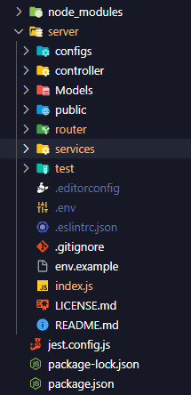

# API_NodeJS_example

## 🔑 [](./LICENSE.md)

# 📇Indice:

- <a href="#sobre-o-projeto">Sobre o projeto</a>
- <a href="#funcionalidades-da-api">Funcionalidades da API</a>
- <a href="#arquitetura-da-aplicação">Arquitetura da Aplicação</a>
- <a href="#tecnologias-utilizadas">Tecnologias utilizadas</a>
- <a href="#como-executar-o-projeto">Como executar o projeto</a>
- <a href="#autor">Autor</a>

# 🔎Sobre o projeto:

A **API_NodeJS_example** é um modelo de [API](https://pt.wikipedia.org/wiki/Interface_de_programa%C3%A7%C3%A3o_de_aplica%C3%A7%C3%B5es), criado e desenvolvido para exemplificar o uso de uma API em uma aplicação na parte de [Back-end](https://www.ewally.com.br/blog/ajudando-sua-empresa/backend#:~:text=O%20backend%20%C3%A9%20a%20estrutura,ambientes%20eletr%C3%B4nicos%20operem%20em%20sincronia.), como exemplo esta é usada originalmente com o projeto Angular [Lista_contatos_angular](https://github.com/R1TKILL/Lista_contatos_angular), apesar de ser possível testar com qualquer ferramenta que simule um cliente.

 Além de que se tem outra utilidade, pois com ênfase em sua arquitetura de pastas, os arquivos podem ser substituíveis pelos arquivos do próprio usuário que deseja utilizar-se deste modelo, visualizando nos arquivos já finalizados como se relacionam em um projeto.

# 📱Funcionalidades da API:

  ### CRUD completo dos usuários

  - [x] Cadastro de cliente.
  - [x] Obtenção de todos os cliente.
  - [x] Obtenção de cliente por id.
  - [x] Atuaalização de cliente por id.
  - [x] Remoção de cliente por id.

# 🧩Arquitetura da Aplicação:



# 🔧Tecnologias utilizadas: 

- [Javascript](https://developer.mozilla.org/pt-BR/docs/Learn/Getting_started_with_the_web/JavaScript_basics) - **vES6**
- [NodeJS](https://site.alura.com.br/artigos/node-js?utm_term=&utm_campaign=%5BSearch%5D+%5BPerformance%5D+-+Dynamic+Search+Ads+-+Artigos+e+Conte%C3%BAdos&utm_source=adwords&utm_medium=ppc&hsa_acc=7964138385&hsa_cam=11384329873&hsa_grp=111087461203&hsa_ad=682526577071&hsa_src=g&hsa_tgt=dsa-843358956400&hsa_kw=&hsa_mt=&hsa_net=adwords&hsa_ver=3&gad_source=1&gclid=CjwKCAiAg9urBhB_EiwAgw88mbohTdP4BfuFLGhI4hcKbBIuSHRXC6gOKy97K3juS8tlA27QJZ0KOxoC46AQAvD_BwE) - **v18.17.1**
- [Npm](https://www.hostinger.com.br/tutoriais/o-que-e-npm#:~:text=O%20npm%20%C3%A9%20uma%20ferramenta,necess%C3%A1rias%20para%20executar%20um%20projeto.) - **v9.6.7**
- [Nodemon](https://www.linkedin.com/pulse/nodemon-um-amigo-para-os-desenvolvedores-nodejs-thomas-lincoln/?originalSubdomain=pt) - **v3.0.1**
- [Body-parser](https://medium.com/@febatistaa/como-converter-os-dados-de-uma-requisi%C3%A7%C3%A3o-com-o-body-parser-2b5b93100f00) -  **v1.20.2** 
- [Cors](https://www.treinaweb.com.br/blog/o-que-e-cors-e-como-resolver-os-principais-erros) - **v2.8.5**  
- [Dotenv](https://blog.lsantos.dev/dotenv-nodejs/#:~:text=ou%20env%2Dconfig.-,dotenv,ambiente%20na%20mem%C3%B3ria%20do%20runtime.) - **v16.3.1**  
- [Express](https://www.treinaweb.com.br/blog/o-que-e-o-express-js) - **v4.18.2**  
- [Sequelize](https://www.linkedin.com/pulse/o-que-%C3%A9-sequelize-thomas-lincoln/?originalSubdomain=pt) - **v6.32.1**
- [sequelize-cli](https://imasters.com.br/banco-de-dados/tutorial-de-migrations-com-node-js-e-sequelize#:~:text=Sequelize%20CLI,ele%2C%20s%C3%B3%20estou%20apresentando%20agora.) - **v6.6.2** 
- [supertest](https://imasters.com.br/desenvolvimento/tdd-como-criar-unit-tests-em-node-js-com-tape#:~:text=Um%20deles%20%C3%A9%20o%20m%C3%B3dulo,qualquer%20outro%20m%C3%B3dulo%20de%20asser%C3%A7%C3%B5es.) - **v6.3.3** 
- [jest](https://coodesh.com/blog/dicionario/o-que-e-jest/#:~:text=Jest%20%C3%A9%20um%20poderoso%20framework,%2C%20no%20lado%20front%2Dend.) - **v29.7.0**
- [pino](https://github.com/pinojs/pino) - **v8.17.1**
- [pino-rotating-file-stream](https://github.com/thelicato/pino-rotating-file-stream) - **v0.0.2** 

# 🏁Como iniciar o projeto:

  ### Pré-requisitos para execução: NodeJS - LTS

  ```bash

    #clonar repositório:
    $ git clone https://github.com/R1TKILL/API_NodeJS_example

    #Entrar na pasta do projeto:
    $ cd server

    #Se necessário instalar as dependências:

      #Nodemon
      $ npm install nodemon

      #Body-parser
      $ npm install body-parser

      #Cors
      $ npm install cors

      #Dotenv
      $ npm install dotenv

      #Express
      $ npm install express

      #Sequelize
      $ npm install sequelize

			#Para testes unitários caso queira testar.

			#Jest
			$ npm install jest

			#Jest intellisense
			$ npm install @types/jest

			#supertest
			$ npm install supertest

			# Para os logs:
			$ npm install pino

			# Pegar todos as informações de requisições web em logs:
			$ npm install pino-http

			# Para rotacionar os logs:
			$ npm install pino-rotating-file-stream

      #Execute o projeto:
      $ nodemon index.js 

  ```

### Configurando o .env	

Também é necessário configurar suas credenciais para o banco e ambiente através das variaveis de ambiente, pode-se utilizar as chaves em **.env.example**, definindo seus própios valores em um .env, caso tenha dúvidas acesse: [como usar o .env](https://www.freecodecamp.org/portuguese/news/como-usar-variaveis-de-ambiente-do-node-com-um-arquivo-dotenv-para-node-js-e-npm/)

### Fazendo a migração do database:

```bash

	#Comando para criar novas migrations:
	$ npx sequelize-cli migration:generate --name create-People

	#Comando para executar as migrations e trazer as tabelas atuais da API para o seu projeto:
	$ npx sequelize-cli db:migrate

	#Desfazer as migrations, derruba a tabela:
	$ npx sequelize-cli db:migrate:undo

	#Criando as seeders:
	$ npx sequelize-cli seed:generate --name peoples

	#Populando banco de dados com as seeds:
	$ npx sequelize-cli db:seed:all

	#rRemovendo todos os dados banco de dados:
	$ npx sequelize-cli db:seed:undo

	#OBS: Lembrando que para isso deve-se ter o sequelize-cli instalado em node-modules, e configurar as pastas corretamente ou altera-las no arquivo '.sequelizerc', apontando para o arquivo de configuração corretamente.

 ```


# 👟Próximos passos:

  ### Adicionar o token JWT:

  - [ ] Para o tempo limite de validação até o novo login.

  ### Implementar parte que obtém o login de um front conectado a esta API:

  - [ ] Para poder criptografar as informações com um hash.


# 🧑‍💻Autor:

Antonio Junior Rodrigues Mota - R1TKILL

Linkedin: http://www.linkedin.com/in/antonio-junior-rodrigues-mota-8a568a173

Email: antoniojunio402@gmail.com
